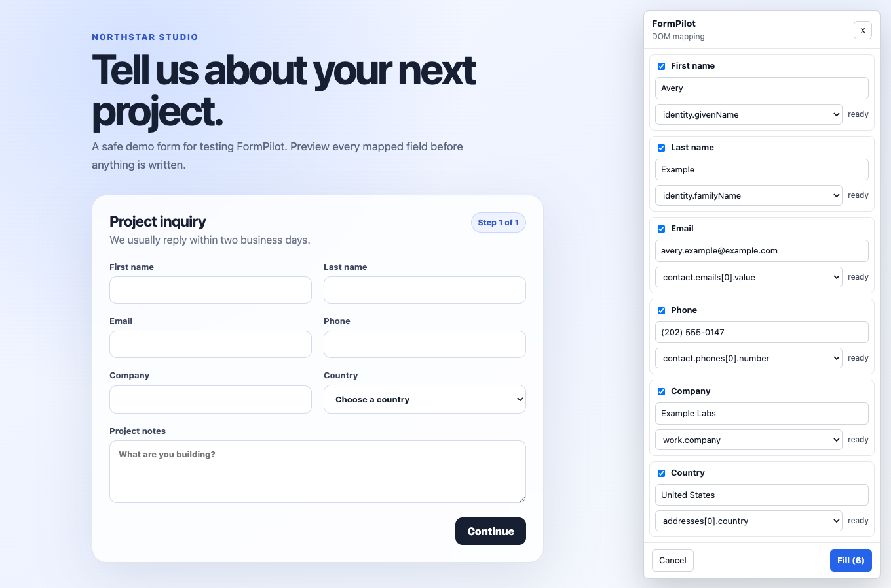
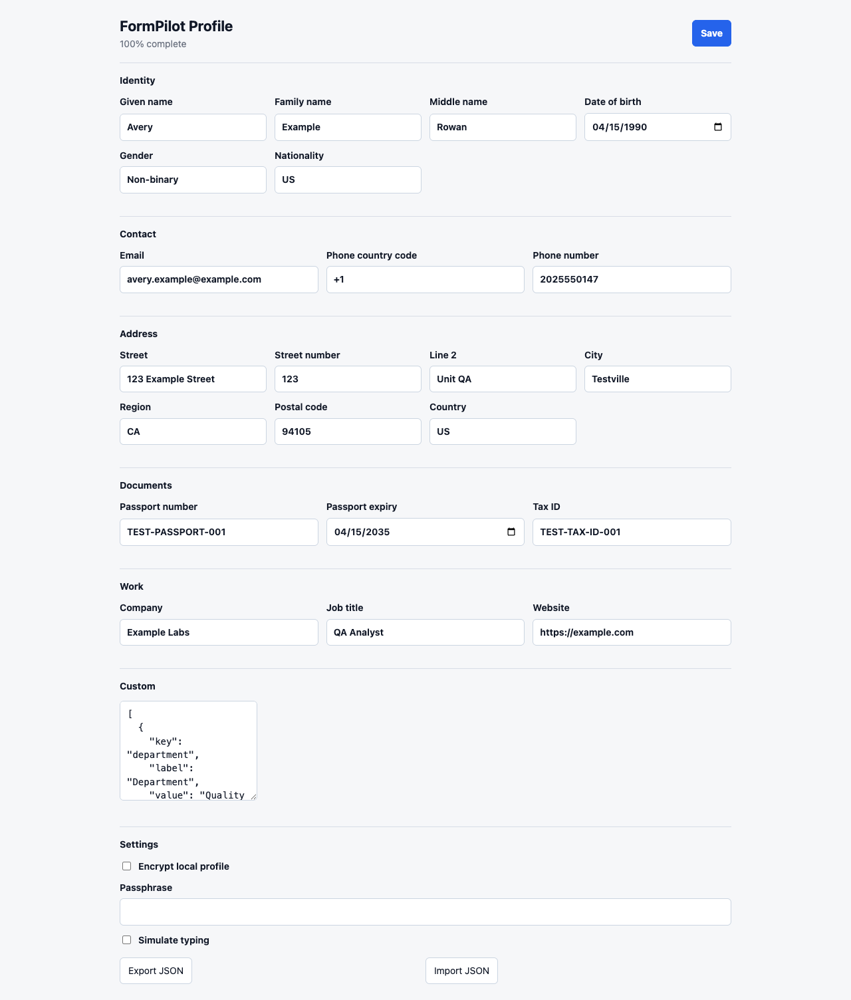
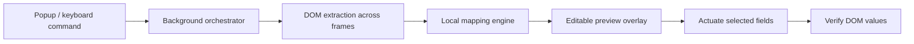

<div align="center">

# FormPilot

**Preview-first, local form filling for Chrome.**

[](wxt.config.ts)
[](https://wxt.dev/)
[](package.json)
[](#privacy-and-safety)
[](LICENSE)

</div>

FormPilot reads the current page, maps your local profile to eligible fields, and shows every proposed value before filling. It is designed to save typing without turning control over to an opaque automation flow.



> **Project status:** active early preview. Install from source; FormPilot is not currently distributed through the Chrome Web Store.

## What makes it different

- **Preview before fill** — inspect, disable, or correct every mapped field.
- **Local profile** — profile data stays in Chrome local storage with optional AES-GCM encryption.
- **No cloud fallback** — uses Chrome's built-in Prompt API when available and a deterministic local mapper otherwise.
- **Safety-aware** — skips passwords, payments, OTPs, banking details, uploads, consent controls, honeypots, and other protected fields.
- **Preserves intent** — prefilled values are not overwritten by default.
- **Handles real pages** — supports labels, nearby text, open shadow roots, same-origin frames, multi-form pages, and common custom controls.
- **Verify after fill** — checks the resulting DOM value and surfaces failures instead of reporting false success.

## Install from source

Requirements: Chrome 138+, Node.js 22+, and pnpm 10+.

```bash
git clone https://github.com/size12font/Formpilot.git
cd Formpilot
pnpm install
pnpm build
```

Then open `chrome://extensions`:

1. Enable **Developer mode**.
2. Choose **Load unpacked**.
3. Select `dist/chrome-mv3`.
4. Open FormPilot settings and create your local profile.

## Use

1. Open a page containing a form.
2. Select the FormPilot extension or press `Command-Shift-Y` on macOS / `Ctrl-Shift-Y` elsewhere.
3. Review proposed mappings in the side panel.
4. Disable or correct any field.
5. Choose **Fill**. FormPilot does not submit the form.

## Local profile

<details>
<summary>See the profile editor</summary>



</details>

Profiles can include identity, contact, address, document, work, and custom fields. The screenshot uses the repository's synthetic QA profile; it contains no real personal data.

## Privacy and safety

FormPilot does not send profile or form data to an external service. Runtime network access is covered by a dedicated guard test. Optional profile encryption uses a passphrase-derived AES-GCM key, and the passphrase remains in session storage.

The extension requests broad host access because form extraction and filling happen on the page you explicitly activate. FormPilot still applies these write boundaries:

- never submits, purchases, books, uploads, registers, or solves CAPTCHAs;
- skips sensitive, hidden, honeypot, file, password, payment, consent, and OTP controls;
- preserves prefilled fields;
- previews proposed writes and verifies the result.

## Architecture



| Path | Responsibility |
| --- | --- |
| [`src/content`](src/content) | Field extraction, labels, preview overlay, actuation, and verification |
| [`src/background`](src/background) | Request orchestration, frame routing, mapping, Prompt API adapter, and signature cache |
| [`src/options`](src/options) | Local profile editor and encryption settings |
| [`src/shared`](src/shared) | Profile model, transforms, safety policy, storage, and message contracts |
| [`fixtures`](fixtures) | Safe local forms for browser QA |
| [`tests`](tests) | Unit, integration, characterization, and extension-browser coverage |

## Quality gates

```bash
pnpm verify
pnpm test:browser:fixtures
```

The latest sealed real-site matrix covers **100 sites across 36 countries**: **85 pass, 15 safe partial, 0 fail, and 0 submissions**. “Safe partial” means the page was reachable but no safe actionable field remained. See the [remediation summary](qa-results/2026-07-10/remediation-summary.md) and [full QA report](qa-results/2026-07-10/in-the-wild-report.md).

## Recreate README screenshots

```bash
pnpm build:qa
node scripts/serve-fixtures.mjs --host=127.0.0.1 --port=8765
node scripts/capture-readme-screenshots.mjs
```

The QA build injects synthetic `Example` data only.

## Contributing

Issues and focused pull requests are welcome. Read [CONTRIBUTING.md](CONTRIBUTING.md) for tests and safety expectations. Report vulnerabilities privately using [SECURITY.md](SECURITY.md).

## License

MIT © FormPilot contributors.
